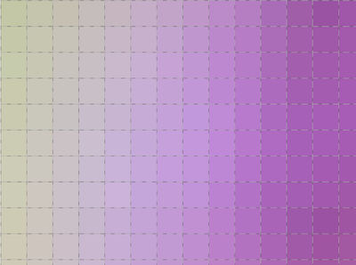

 

# Pixel Grid

The MATLAB function `pixelgrid` superimposes a grid of pixel edges on an image. The purpose is to easily visualize pixel extents when zooming in closely on an image. When viewing an image with a very high zoom factor, the grid is useful for determining the extent of each pixel, especially in regions where pixels have the same or very similar colors.

The pixel grid automatically becomes visible when the image pixels are larger than a certain size on the display.

## Installation

Download the `.mltbx` file from the [GitHub repository releases area](https://github.com/eddins/pixelgrid/releases/) or from the [File Exchange](https://www.mathworks.com/matlabcentral/fileexchange/71622-pixel-grid?s_tid=ta_fx_results). Double-click on the downloaded file to automatically and run the MATLAB add-on installer. This will copy the files to your MATLAB add-ons area and add `pixelgrid` to your MATLAB search path.

Later, you can use the [MATLAB Add-On Manager](https://www.mathworks.com/help/matlab/matlab_env/get-add-ons.html) to uninstall.

## Getting Started

See the [Getting Started](https://www.mathworks.com/matlabcentral/fileexchange/71622-pixel-grid) script for more information.

Copyright &copy; 2024 Steven L. Eddins
